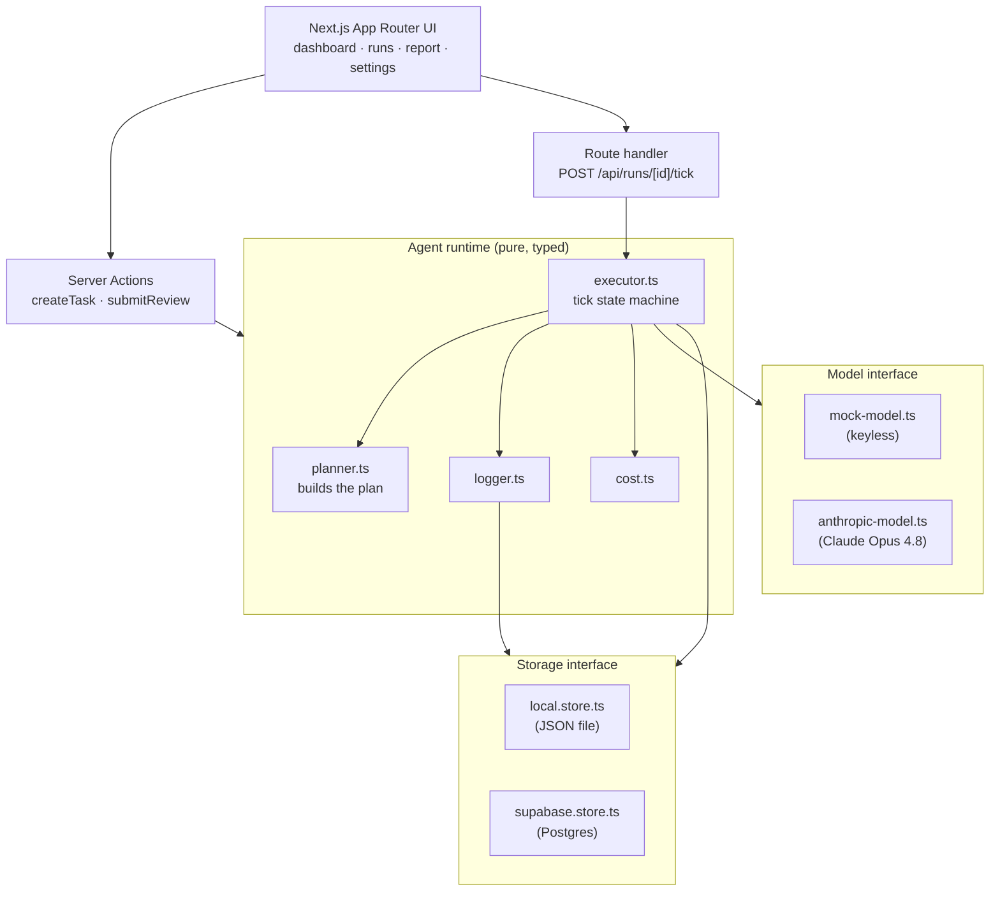
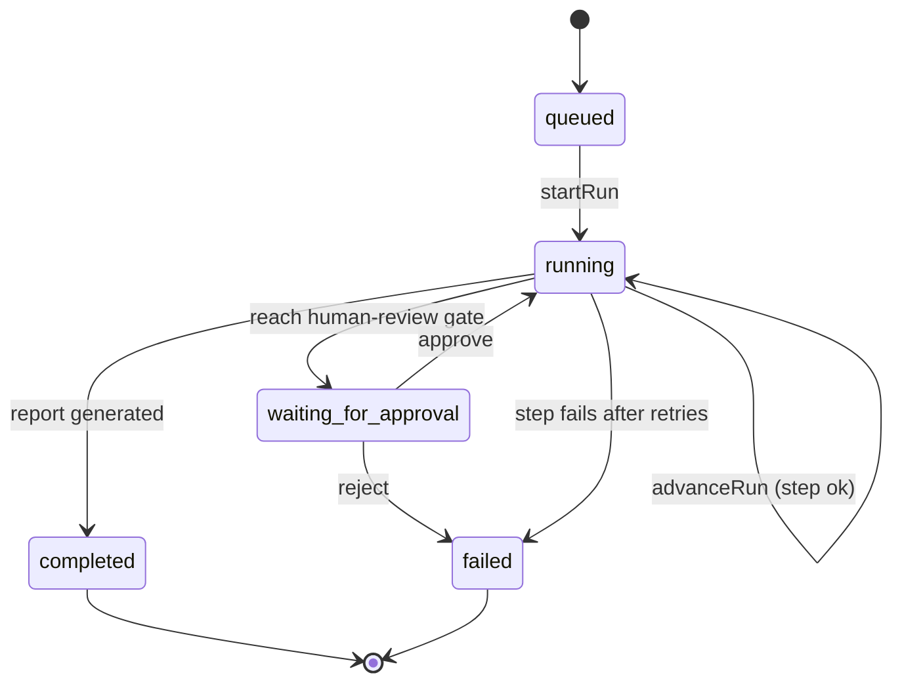

# Research Agent Runtime

**Mission control for research agents.** Give it a research question; it builds a
plan, executes each step through an observable runtime, pauses for your approval,
and produces a structured executive report — with full run history, structured
logs, latency, and token-cost tracking.

This is **not a chatbot**. It's a production-style agent *execution platform*: a
typed runtime state machine, a human-in-the-loop review gate, first-class
observability, and clean adapter seams that let the exact same engine run against
a keyless local demo or real Claude + Supabase in production.

> Runs with **zero configuration** — `pnpm install && pnpm seed && pnpm dev`. No
> API key, no database. Add an `ANTHROPIC_API_KEY` to use real Claude; point it
> at Supabase for real persistence. Nothing else changes.

---

## Why it exists

Most "AI agent" demos are a prompt and a spinner. Real agentic products need the
unglamorous parts: a state machine that survives partial failure, retries,
human approval before irreversible output, and the telemetry to answer *what did
this run cost, how long did it take, and where did it fail?* This project is
built to show those parts working together, with the code organized the way a
team would actually maintain it.

## Core features

- **Agent planning** — a deterministic planner decomposes a task into an ordered
  plan (clarify → research → analyze → synthesize → human review → report),
  scaled by the requested depth and output format.
- **Runtime execution engine** — a tick-based state machine advances runs one
  step at a time with per-step retries, structured logging, and timestamps.
- **Human-in-the-loop** — runs halt at a review gate; approve to generate the
  report, or reject with reviewer notes to fail the run.
- **First-class observability** — every run tracks step status, duration,
  retries, token usage, estimated cost, model, and a live log console.
- **Structured final report** — executive summary, key findings, opportunities,
  risks, recommendations, open questions, and source notes.
- **Swappable adapters** — a `Model` seam (mock ↔ Claude) and a `Storage` seam
  (local JSON file ↔ Supabase Postgres), selected by environment variables.

## Tech stack

| Layer | Choice |
|---|---|
| Framework | Next.js 16 (App Router, Turbopack, React 19, Server Actions) |
| Language | TypeScript (strict) |
| Styling | Tailwind CSS v4 (CSS-first `@theme`, OKLCH tokens) |
| Validation | Zod (schemas are the single source of truth for types) |
| LLM | `@anthropic-ai/sdk` — Claude Opus 4.8, adaptive thinking, structured outputs |
| Persistence | Local JSON file (default) or Supabase (`@supabase/supabase-js`) |
| Icons | lucide-react |

---

## Architecture

The whole design turns on **two adapter seams**. Everything above them depends
only on interfaces, so the same runtime powers a keyless demo and a production
deployment.



### Run lifecycle (the state machine)



### Why a "tick" engine

True streaming and long-lived workers don't fit a serverless request model. The
executor instead exposes `advanceRun()`, which performs **exactly one step per
call**. The run-detail page polls `POST /api/runs/[id]/tick` on an interval, so
execution *appears* live while the server stays stateless. Polling is the clock —
and it keeps ticking through the approval gate, so the moment a human approves,
the next poll resumes execution and generates the report.

### Human-in-the-loop design

The planner inserts a `human_review` step before the report step. When the
executor reaches it, the run transitions to `waiting_for_approval` and stops
advancing. A `ReviewDecision` (approve/reject + notes) is recorded; approve
flips the run back to `running` (the report step then runs on the next tick),
reject marks the run `failed`. Real agent systems need this gate before
irreversible or costly output.

### Observability

Each run records, per step and in aggregate: status, start/complete timestamps
(→ duration), retry count, token usage, and estimated USD cost (priced from
published per-MTok rates). Every engine action emits a structured `AgentLog`
persisted to the store and rendered in a live log console. This is the
differentiator — it's a platform with telemetry, not a UI wrapper around an LLM.

---

## Data model

Defined once as Zod schemas in `src/lib/agent-runtime/types.ts`; TypeScript types
are inferred via `z.infer`, so runtime validation and compile-time types never
drift.

- **ResearchTask** — title, question, context, outputFormat, depth
- **AgentRun** — status, model, timestamps, estimatedCost, tokenUsage, retryCount, report
- **AgentStep** — order, name, kind (`agent`/`human_review`/`report`), status, output, error, tokens, cost
- **AgentLog** — level, message, timestamp, stepId, metadata
- **ReviewDecision** — decision, notes

## Project structure

```
src/
  app/
    (app)/                # sidebar shell + dashboard, runs, tasks, reports, settings
    api/runs/[id]/tick/   # advances a run one step per poll
    actions.ts            # Server Actions (Zod-validated)
  components/             # ui primitives, run views, task form
  lib/
    agent-runtime/        # types, planner, executor, logger, cost, model adapters
    storage/              # store interface + local/supabase adapters
    runtime.ts            # composition root (driver selection)
scripts/seed.ts           # demo data
supabase/migrations/      # SQL schema for the Supabase path
```

---

## Local setup

Requires Node 20+ and pnpm.

```bash
pnpm install
pnpm seed      # optional: 4 realistic demo runs
pnpm dev       # http://localhost:3000
```

Build / typecheck / lint:

```bash
pnpm build
pnpm lint
```

### Environment variables

Copy `env.example` to `.env.local`. Every value has a safe default.

| Variable | Default | Notes |
|---|---|---|
| `STORAGE_DRIVER` | `local` | `local` (JSON file) or `supabase` |
| `MODEL_DRIVER` | `mock` | `mock` (keyless) or `anthropic` |
| `ANTHROPIC_API_KEY` | — | required when `MODEL_DRIVER=anthropic` |
| `ANTHROPIC_MODEL` | `claude-opus-4-8` | model id for live runs |
| `NEXT_PUBLIC_SUPABASE_URL` | — | required when `STORAGE_DRIVER=supabase` |
| `SUPABASE_SERVICE_ROLE_KEY` | — | required when `STORAGE_DRIVER=supabase` |

> If `MODEL_DRIVER=anthropic` is set without a key, the runtime safely falls
> back to the mock model (surfaced on the Settings page).

### Using real Claude

```bash
# .env.local
MODEL_DRIVER=anthropic
ANTHROPIC_API_KEY=sk-ant-...
```

The Anthropic adapter uses **adaptive thinking** and **structured outputs**
(`output_config.format`) to guarantee a schema-valid report.

### Using Supabase

1. Create a Supabase project.
2. Run `supabase/migrations/0001_init.sql` in the SQL editor.
3. Set `STORAGE_DRIVER=supabase`, `NEXT_PUBLIC_SUPABASE_URL`, and
   `SUPABASE_SERVICE_ROLE_KEY` in `.env.local`.

---

## Deployment

**Vercel** (recommended): import the repo, set env vars, deploy. The public demo
should use `STORAGE_DRIVER=supabase` — local file writes are ephemeral on
serverless. **Railway** works equally well for a long-running container.

---

## Design decisions

- **Repository + adapter pattern** over a single concrete DB/LLM, so the engine
  is testable in isolation and portable across environments.
- **Zod as the source of truth** for both validation and types.
- **String-literal union statuses** (not enums) so the executor is a checkable
  state machine — an unhandled status fails the build.
- **Server Actions validate at the boundary** — they're public endpoints.
- **OKLCH design tokens** in `@theme` for perceptually-even status colors in a
  dark observability UI.

## Roadmap

- Real research tools (web search / fetch) behind the existing `Model` seam
- Streaming step output via SSE instead of polling
- Auth + multi-tenant run isolation (Supabase RLS policies)
- Run comparison and cost budgets / alerts
- Exportable reports (PDF / Markdown)
- Unit tests for the executor state machine; Playwright E2E for the happy path

## License

MIT
